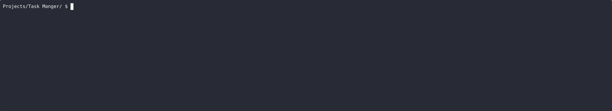

# Task Manager CLI

A simple command-line task manager built using Python.

## Features
- Add tasks
- View tasks
- Mark tasks as complete
- Delete tasks
- Persistent storage using JSON

## How to Run

```bash
python task_manager.py
```

## Demo


